<!DOCTYPE HTML PUBLIC "-//W3C//DTD HTML 4.01 Transitional//EN">
<html>
  <head>
  <meta http-equiv="content-type" content="text/html; charset=windows-1250">
  <h1>ODB++ to Phoenix X-ray CAD data converter</h1>
  </head>
 

  
<b>ODB++ to Phoenix X-ray CAD data converter</big></b>

   
  This program loads an ODB++ directory and exports CAD data for Phoenix X-ray Micromex and Nanomex PCB inspection machines. Top and Bottom component files are generated separately, pads file is always common. Component coordinates are exported in the same format as in Phoenix X-ray demo board. Pad coordinates are generated differently, which requires some care when importing them into Phoenix Xact software (<a href="#3">see chapter 3</a>). Keep in mind that the Phoenix Xact software has several limitations which need to be taken into account. Among others, it expects that the lower left corner of the board lies at the origin of the coordinate system. You have to either fix this manually in your layour editor (<a href="#1">see chapter 1</a>) or use "Remove large coordinate offsets" option in the converter (<a href="#2">see chapter 2</a>). Moreover, pad dimensions are generated from solder mask openings. To obtain proper pad dimensions, you have to set solder mask expansion to zero before generating the ODB++ data. <a href="#1">Chapter 1</a> contains instructions how to do these adjustments in Altium Designer and Cadence products. If you plan to perform x-ray inspection of SMD pads only, you can use solder paste layers instead of solder mask layers. But again, you need to make sure that the solder paste covers whole pads.
   
    
  ODB++ converter is located at <a href="https://github.com/popelavojtech/ODBtoRTG">https://github.com/popelavojtech/ODBtoRTG</a>
  
  <h1 id="1">1. Exporting ODB++ data</h1>
  The ODB++. to Phoenix X-ray CAD Data Converter works best with Altium Designer 15, but was also tested with Cadence PCB Designer 16. ODB++ data from other PCB layout editors will probably work, 
  though trying several different export configurations may be necessary to achieve best results. <a href="#4">See chapter 4</a> for list of known issues. 
   
  
  <h2 id="1.1">1.1. Exporting ODB++ from Altium Designer</h2>
  Altium Designer has built-in ODB++ support, but you need to prepare the board first. Move the origin of the coordinate system to the lower left corner of the board using Edit - Origin - Set. Then set the solder mask expansion to zero in menu Design - Rules - Mask - SolderMaskExpansion. 
   
   
  

<a href="img/Fig01.jpg">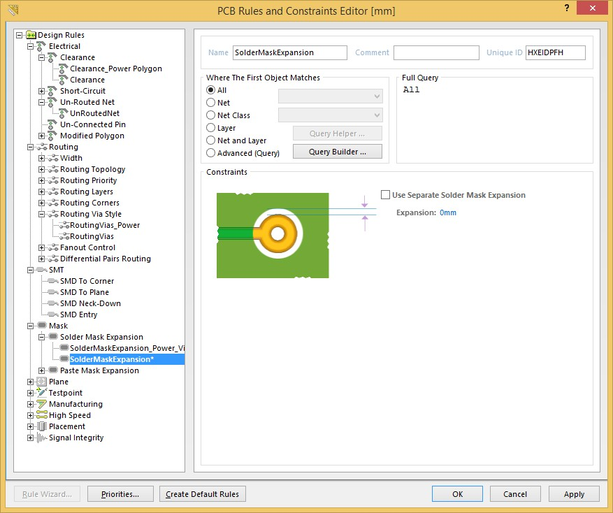
</a>

   
  
  Then generate the ODB++ via File - Fabrication Outputs - ODB++ Files. You can use default export settings as seen in figure below.
   
   
  

<a href="img/Fig02.jpg">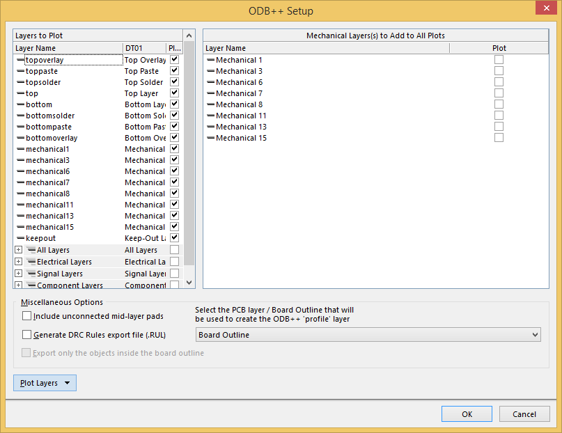
</a>

   
   
  
  <h2 id="1.2">1.2. Exporting ODB++ from Cadence layout editors</h2>
  Before ODB++ export, you have to move the origin of the coordinate system to the lower left corner of the board. This can be done either by moving the entire board or by changing drawing parameters (see <a href="http://community.cadence.com/cadence_technology_forums/f/27/t/4577">http://community.cadence.com/cadence_technology_forums/f/27/t/4577</a> for example). Then you need to set solder mask expansion around pads to zero. Usually, this requires editing all pads in the Padstack Editor, but it may be possible to do it en masse with 3rd party tools.
   
   
  

<a href="img/Fig03.png">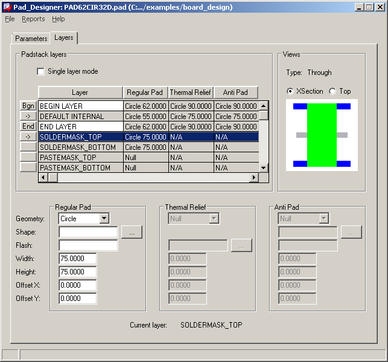
</a>

   
   
  Then you need to add the solder mask layers into output films, this is done in Manufacture - Artwork menu. Normally, the pin solder mask opening are generated from PIN/SOLDERMASK_BOTTOM and PIN/SOLDERMASK_TOP layers.
   
   
  

<a href="img/Fig04.png">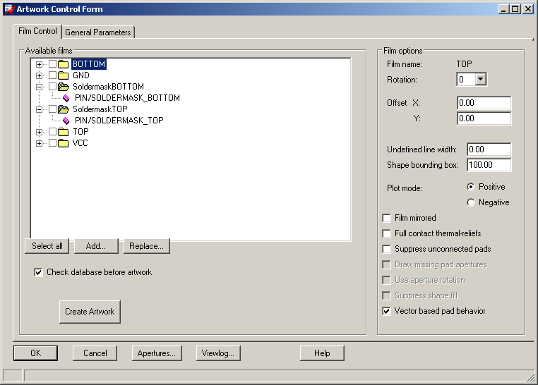
</a>
	
   
   
  To enable ODB++ export from Cadence products, you first need to download and install free ODB++ Inside for Cadence Allegro from ODB++ Solutions Alliance website. <a href="http://www.odb-sa.com/resources/odb-inside-for-cadence-allegro/">http://www.odb-sa.com/resources/odb-inside-for-cadence-allegro/</a> You need to register on the website before they allow you to download it. After you install it, you can export ODB data with File - Export - ODB++ inside. First, a popup will ask "Do you want to extract net impedance average?"; choose "No". In the next window, switch "Create archive" to "Uncompressed" as seen in figure below.
   
   
  

<a href="img/Fig05.png">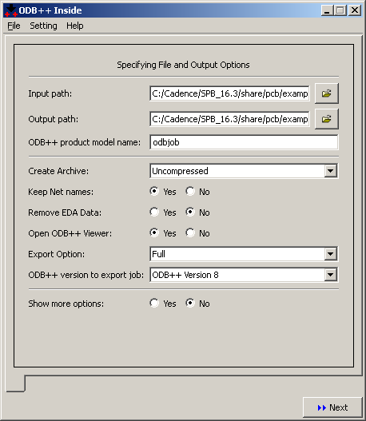
</a>
	
   
   
  <h1 id="2">2. Using ODB++ to Phoenix X-ray CAD Data Converter</h1>
  To run ODB++ to Phoenix X-ray CAD Data Converter, you need free Java Runtime which can be downloaded at <a href="https://java.com/en/download/">https://java.com/en/download/</a>. After that, the steps are pretty straightforward:
  <blockquote>
  - Browse for ODB++ directory generated by your layout editor. List of ODB++ layers should appear in the two rectangular windows below.   
  - Choose which component layers will be generated (Top, Bottom or both).    
  - Select appropriate component and pad layers from the ODB++ data. For component data, select COMP_+_TOP or COMP_+_BOT. For pad data, select TOPSOLDER or BOTTOMSOLDER (SMT and SMB on Cadence ODB++ data).  Figure below shows a typical example. Note that if you plan to perform x-ray inspection of SMD pads only, you can use TOPPASTE or BOTTOMPASTE layers instead.      
	

<a href="img/Fig06.png">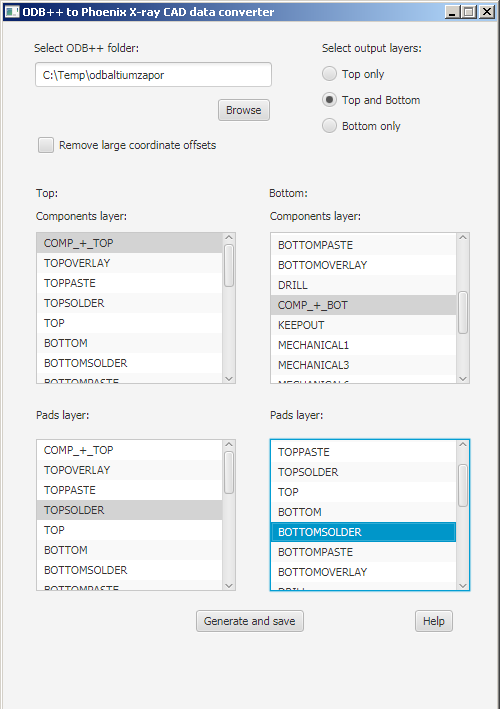
</a>
	
	 
     
  - If you were unable to fix the origin of the coordinate system (<a href="#1">chapter 1</a>), you can enable "Remove large coordinate offsets" in the converter. It will shift all coordinates to facilitate import into Phoenix Xact software, but the new coordinates will obviously not correspond to coordinates in your layout editor.     
  - Click on "Generate and save" buton to save the CAD data on your drive.  
  </blockquote>
  
  <h1 id="3">3. Importing CAD data into Phoenix Xact</h1>
  After you transfer the CAD data files to your x-ray machine, you need to import component file(s) first. Figure below shows layer setup, which is the same as in Phoenix X-ray demo board.
   
   
  

<a href="img/Fig07.png">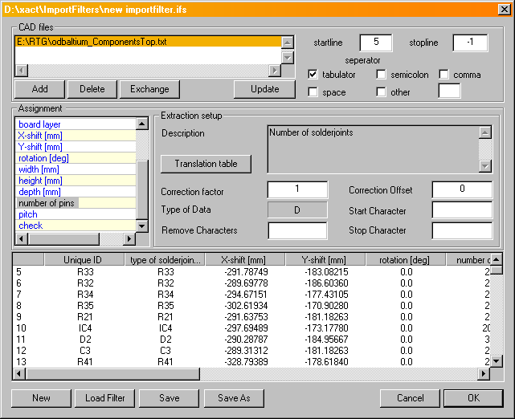
</a>
	
   
  Some care needs to be taken while importing pad file(s), because their coordinates have different format. You need to import them as "component centroids", but you have to enable "correct coordinates by component centers" in the final selection window.
     
    
  

<a href="img/Fig08.png">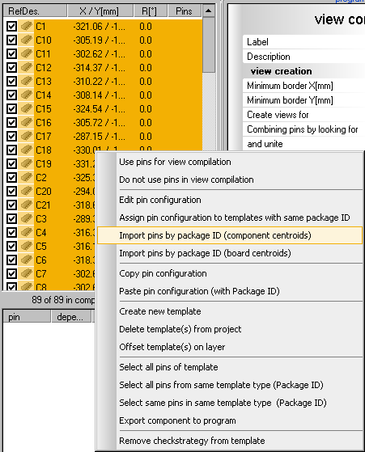
</a>
	
   
  

<a href="img/Fig09.png">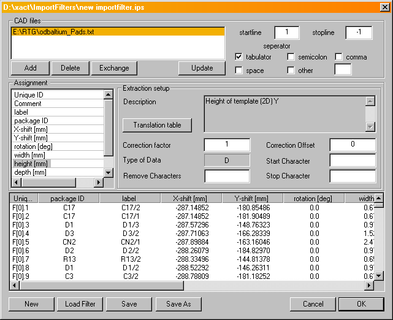
</a>
	
   
  

<a href="img/Fig10.png">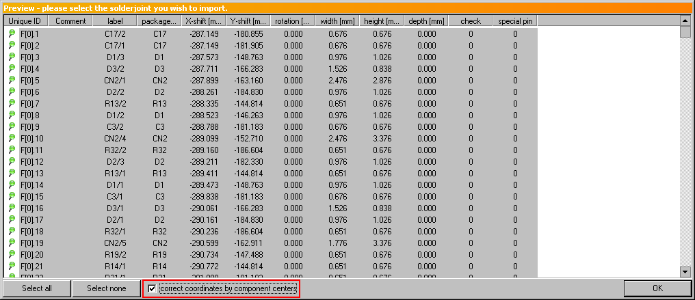
</a>
	
   
   
  
  <h1 id="4">4. Known issues and their possible solutions</h1>
  Due to complexity of the ODB++ format, variablity of PCB layout editors and limitations of Phoexnix Xact software, you may encounter some irregularities in the CAD data. Here is list of some common problems.

  <h2 id="4.1">4.1. Misplaced component origins</h2>
  In most PCB layout editors, components have their own origins, which also serve as placement coordinates for pick&place machines. These origins thus lie somewhere inside the component's body, most often in its centre. However, certain PCB editors (and/or poorly designed component libraries) don't follow this rule and the origins are outside the components. You need to fix all such components before exporting the ODB++ data, otherwise the component bodies will be misplaced relative to their pads. This is often the issue with Altium Designer; figure below shows components on the "Developer Tool - DT01" example board after importing the data into Phoenix Xact. Many component bodies are obviously misplaced, notably IC1, IC5 and most connectors. However, this is purely visual issue; pad coordinates are correct.
   
   
  

<a href="img/Fig11.png">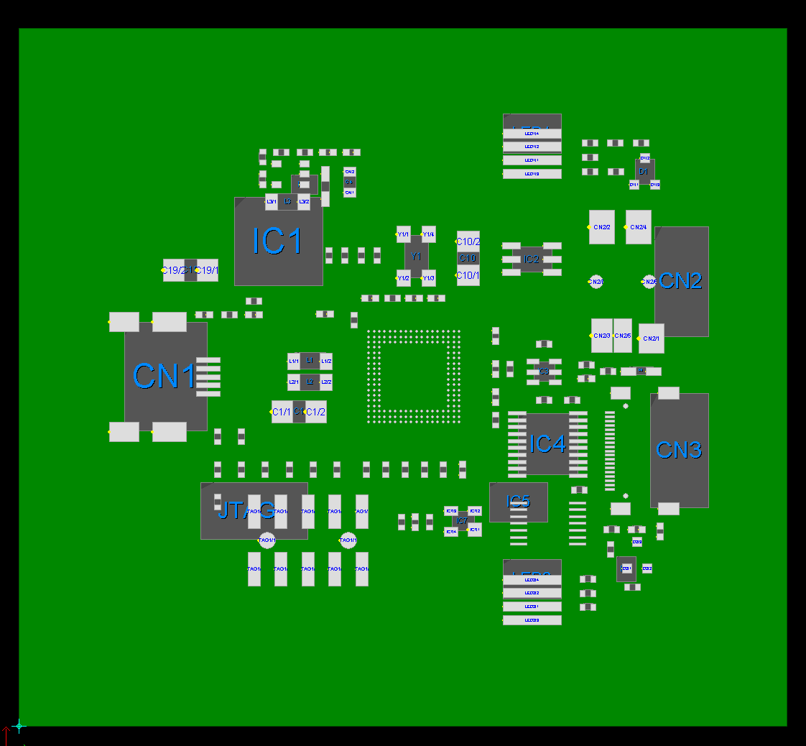
</a>
	
   
   
  
  <h2 id="4.2">4.2. Incorrect conversion of arbitrary pad angles</h2>
  The ODB++ to Phoenix X-ray CAD Data Converter may fail to properly convert pad angles if their rotation is not a multiple of 90 degrees. This is particularly the issue with Cadence products, because they output such pads as ODB++ macro. Thus the pads will appear on correct coordinates, but their rotation will be 0 degrees. You need to manually fix angles of these pads in Phoenix Xact software. Support for ODB++ macros may be added to the converter in the future, depending on demand. Figures below illustrate this issue on an Orcad board.
   
   
  

<a href="img/Fig12.png">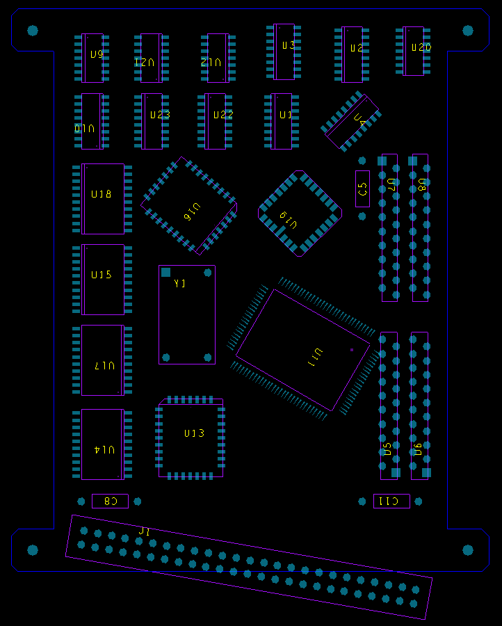
</a>
	
   
   
   
   
  

<a href="img/Fig13.png">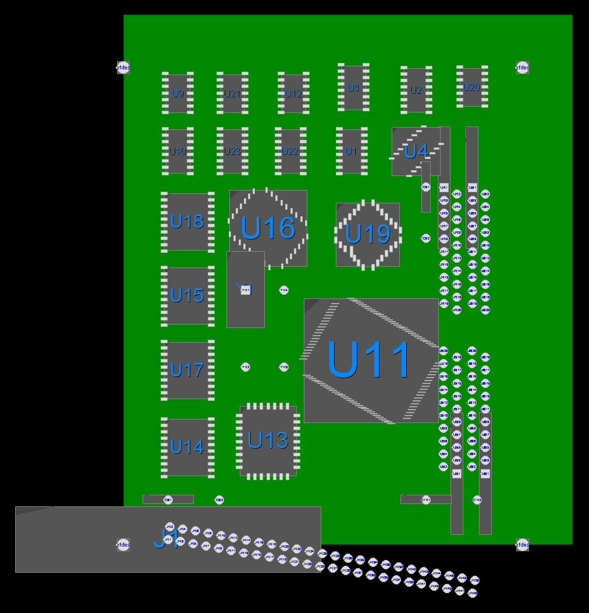
</a>
	
  
  <h2 id="5">5. About</h2>
  ODB++ to Phoenix X-ray CAD Data Converter, version 1.0  
  by Vojtech Popela, <a href="mailto:popela.vojtech@gmail.com">popela.vojtech@gmail.com</a>
  
   
  This program was created as a part of bachelor's thesis "Generovani pozicnich dat pro rentgen DPS" at the Department of Telecommunications, Brno University of Technology.
   
   
  <b>THIS PROGRAM IS PROVIDED AS IS AND WITHOUT WARRANTY OF ANY KIND, EXPRESSED OR IMPLIED</b>
  
